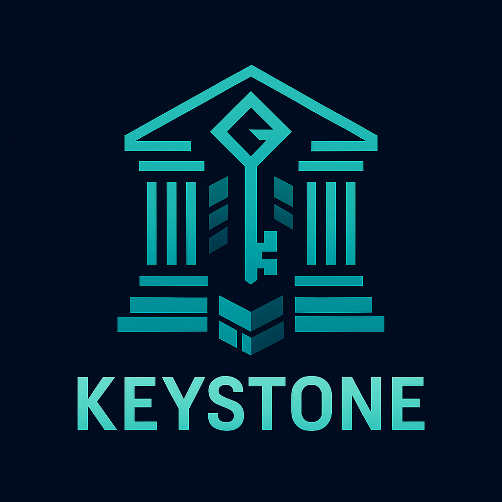

<div align="center">
  
</div>

# 🏛️ Keystone

> Core ledger and transaction engine powering the Ghost ecosystem.

**Keystone** is a modular, identity-aware, and audit-friendly execution layer designed for use in distributed systems, Web3 runtimes, and secure transactional infrastructure. It integrates tightly with `zledger`, and optionally supports `shroud`, `zsig`, and `zwallet`.

## 🎯 Core Functionality

- ✅ **Web3 Runtime** - Provides execution environment for smart contracts/dApps
- ✅ **Transactional Infrastructure** - Handles secure transaction processing
- ✅ **Multiple Nodes/Systems** - Supports distributed deployment and coordination

---

## ✨ Features

* 📒 Account abstraction via `account.zig`
* 💰 Double-entry transactions and balances (`tx.zig`)
* 📜 Journaled state changes with audit trail (`journal.zig`, `audit.zig`)
* 🔍 Signature and identity-aware validation (optional)
* 🧱 Designed for ZVM and Ghostchain compatibility
* ⚖️ Zero external dependencies by default


## 🧪 Example Usage

```zig
const keystone = @import("keystone");
const ledger = keystone.initLedger(allocator);

try ledger.createAccount("alice", .asset, "USD");
try ledger.createAccount("bob", .asset, "USD");

const tx = try keystone.buildTransaction(
    allocator,
    500_000,
    "USD",
    "alice",
    "bob",
    "Transfer"
);
try ledger.processTransaction(tx);
```

---

## 🚧 Roadmap

* [x] Keystone v0.1.0 — Core ledger API
* [ ] Keystone v0.2.0 — Journal replay + audit layer
* [ ] Keystone v0.3.0 — Shroud/identity hooks (pluggable)
* [ ] Keystone v0.4.0 — CLI + ZVM execution gateway

---

## 📜 License

MIT

---

